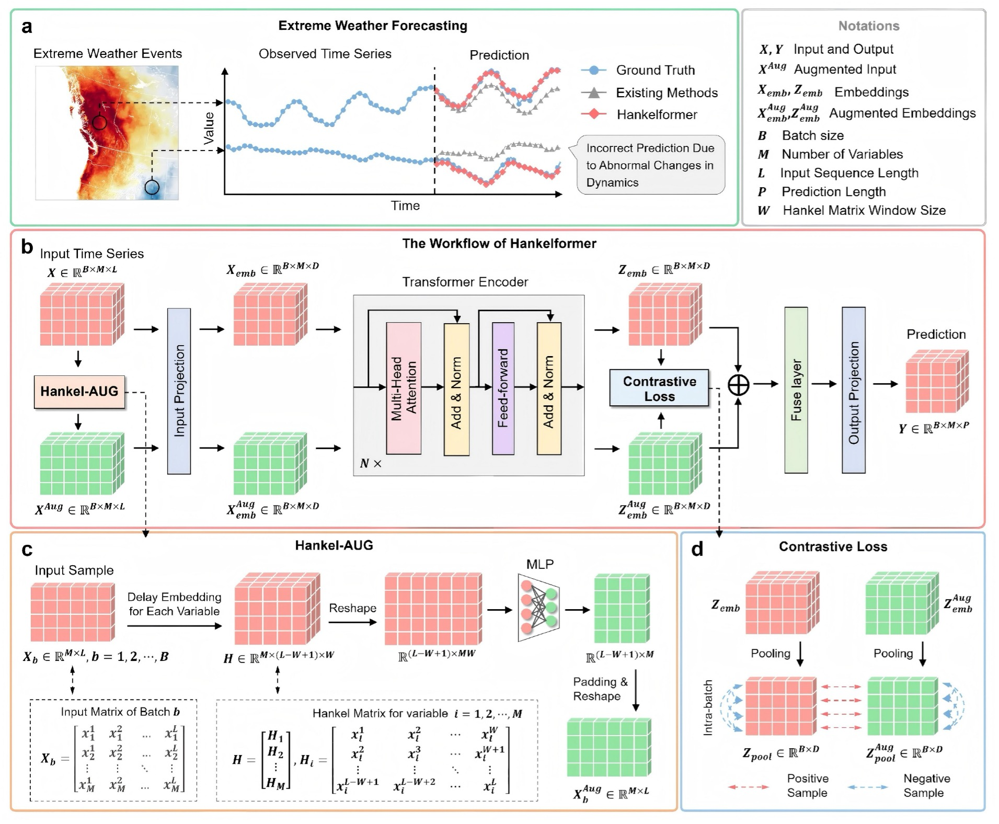

# Forecasting Extreme Weather Events with Hankel-Augmented Contrastive Representation Learning
This repository is the official implementation for the paper: "Hankelformer: Forecasting Extreme Weather Events with Hankel-Augmented Contrastive Learning for Spatiotemporal Representations".
## Overall Architecture

## Citation

## Acknowledgement
We appreciate the following GitHub repos a lot for their valuable code and efforts.
- iTransformer (https://github.com/thuml/iTransformer)
- Time-Series-Library (https://github.com/thuml/Time-Series-Library)
